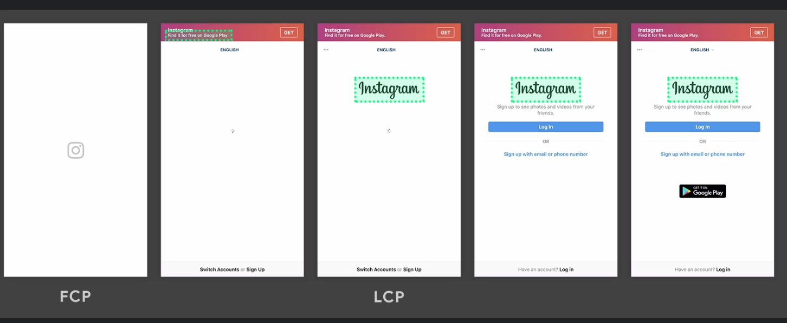

웹 성능 개선을 위해 Web Vital 수치를 확인하던 중에, 서비스 되고 있는 앱에서 로고가 그려지고 있음에도 FP만 측정이 되고 FCP가 뒤늦게 측정이 되는 현상이 있어,
이에 대한 원인을 파악하기 위해 FP와 FCP의 차이에 대해 알아보았던 내용을 정리하였다.

<!--truncate-->

## FP : First Paint (FP)

**FP**라는 의미 그대로 서버로부터 `index.html`을 가져와서 브라우저가 이를 해석하고 난 뒤에 사용자에게 보여지는 화면에 처음으 CSS와 같은 스타일링 요소를 이용하여 화면에 Painting되어 그려지는 시점을 의미한다.
해당 시점에 DOM에 어떠한 conent도 포함되어 있지 않지만 사용자는 화면에 무언가 그려지고 가져와서 동작하고자 한다는 것을 예상할 수 있다.

index.html에는 아래 예시와 같이 최소한 다음과 같은 요소들이 포함되어야 FP로 측정이 된다.

- CSS 요소

```html
<style>
  body {
    background: #32d8b4;
  }
</style>
<body></body>
```

- Content가 포함되지 않은 DOM 요소

```html
<body>
  <input type="text" />
</body>
```

- Content가 포함된 DOM 요소

```html
<body>
  <p>TEST</p>
</body>
```

## FCP : First Contentful Paint

DOM 요소에 처음으로 Content가 포함된 내용이 처음으로 화면에 보여지는 시점으로 FP와 동일한 시점에 측정이 될 수도 있다.
여기서 content는 **image, svg, canvas, text**와 같은 요소를 의미한다.

다음은 content에 해당하는 요소에 대한 예시이다.

### image

```html

```

### svg

```html
<svg height="100" width="100">
  <circle cx="50" cy="50" r="40" stroke="black" stroke-width="3" fill="red" />
</svg>
```

### canvas

```html
<body>
  <canvas
    id="myCanvas"
    width="200"
    height="100"
    style="border:1px solid #eeeeee;"
  >
  </canvas>
</body>
<script>
  var c = document.getElementById('myCanvas');
  var ctx = c.getContext('2d');
  ctx.beginPath();
  ctx.arc(95, 50, 40, 0, 2 * Math.PI);
  ctx.stroke();
</script>
```

참고로 아래 예시와 같이 비어있는 경우에는 FCP로 측정되지 않는다.

```html
<canvas id="myCanvas" width="200" height="100"></canvas>
<!-- or -->
<canvas
  id="myCanvas2"
  width="200"
  height="100"
  style="border:1px solid #eeeeee;"
></canvas>
```

### text

```html
<body>
  <p>TEXT</p>
</body>
```

## FP와 FCP 측정 시점 예시

FP와 FCP가 측정되는 시점에 대한 예시 이미지를 보면 다음과 같다.

아래의 예시는 화면에 헤더 부분의 배경 색상이 입혀지기 시작하는 시점에 FP가 측정된 후, TEXT 요소가 포함된 DOM 요소가 그려지는 시점에 FCP가 측정이 되었다.


다음의 예시는 로고가 그려지는 시점이 사용자에게 처음 그려지는 화면으로 FP와 FCP가 동시에 측정이 되는 케이스이다.


## Conclusion

서비스 되고 있는 앱에서 로고가 그려지고 있음에도 FP만 측정이 되고 FCP가 뒤늦게 측정이 되는 현상의 원인은 다음과 같았다.

로고 애니메이션은 div와 css로 구성되어있었다.
즉, FCP의 측정 기준인 Content 요소가 포함되어 있지 않았다.

그래서 이에 대한 원인을 파악 후, Content 요소를 추가하여 정상적으로 로고가 그려지는 시점에 FCP가 측정이 되도록 수정하였다.

## References

- https://nitropack.io/blog/post/first-contentful-paint-fcp
- https://www.product.webpagetest.org/core-web-vitals/first-contentful-paint
