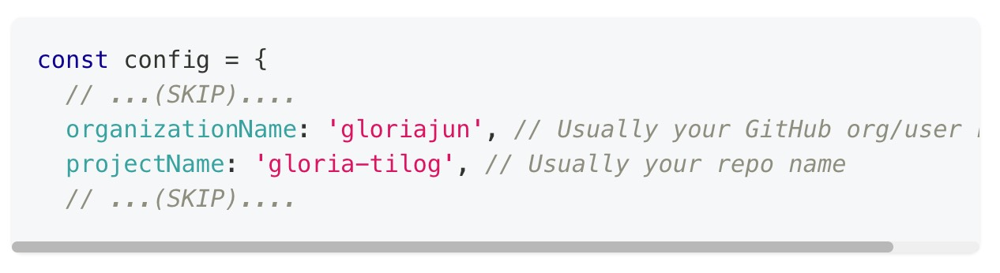
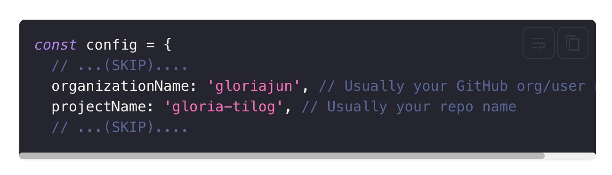

작성한 코드에 대해 기존에 다음과 같이 기본 설정으로 사용하고 있던 부분에 작성된 코드에 대하여 조금 더 가독성이 좋고 이뻐보이도록 하기 위해서 설정을 변경하였다.

## theme

기본적으로 docusaurus에서 기본적으로 설정된 테마는 **Palenight**인데, 이 부분을 내가 즐겨 애용하는(?) [dracula](https://docusaurus.io/docs/markdown-features/code-blocks#theming) 테마를 dark 모드 유무에 상관없이 사용하도록 변경하였다.

```diff title="docusaurus.config.js"
themeConfig:
  prism: {
-    theme: lightCodeTheme,
-    darkTheme: darkCodeTheme,
+   theme: require('prism-react-renderer/themes/dracula'),
  },
}),
```

- 변경 전
  
- 변경 후
  

## Custom magic comments

기본적으로 [`line highlight`](https://docusaurus.io/docs/markdown-features/code-blocks#line-highlighting) 기능이 지원이 되고 있지만,
아래와 같이 작성된 코드에 대한 에러 표시를 하이라이트 하고 싶을 때 사용하기 위한 설정을 추가해주었다.

```js title="docusaurus.config.js"
themeConfig: {
  prism: {
    //...(SKIP)...
      magicComments: [
        // Remember to extend the default highlight class name as well!
        {
          className: 'theme-code-block-highlighted-line',
          line: 'highlight-next-line',
          block: {start: 'highlight-start', end: 'highlight-end'},
        },
        // highlight-start
        {
          className: 'code-block-error-line',
          line: 'error-next-line',
        },
        // highlight-end
      ],
 },
},
```

```css title="src/css/custom.css"
.code-block-error-line {
  background-color: #ff000020;
  display: block;
  margin: 0 calc(-1 * var(--ifm-pre-padding));
  padding: 0 var(--ifm-pre-padding);
  border-left: 3px solid #ff000080;
}
```

위와 같이 설정을 해준 뒤에 다음 예시와 같이 작성을 하면....

````md title="example"
In JavaScript, trying to access properties on `null` will error.

```js
const name = null;
// error-next-line
console.log(name.toUpperCase());
// Uncaught TypeError: Cannot read properties of null (reading 'toUpperCase')
```
````

다음과 같이 _console.log_ 라인에 하이라이트 되어 표시되는 것을 확인할 수 있다.

```js
const name = null;
// error-next-line
console.log(name.toUpperCase());
// Uncaught TypeError: Cannot read properties of null (reading 'toUpperCase')
```

## Additional Plugins

### Interactive code editor

예제 코드를 작성하고, 이에 대한 실행 결과를 첨부해야하는 경우, 기존에는 [CodePen](https://codepen.io/)에서 추가로 작성한 부분을 삽입하고는 했었다.
하지만, docusaurus에서는 [`@docusaurus/theme-live-codeblock`](https://docusaurus.io/docs/api/themes/@docusaurus/theme-live-codeblock)을 제공하여 해당 플러그인을 추가로 설정해주었다.

nx를 이용한 모노레포 구조가 아니라면 다음과 같이 커맨드를 실행하면 된다...

```bash npm2yarn
npm run swizzle @docusaurus/theme-live-codeblock ReactLiveScope --eject
```

근데 [swizzle](https://docusaurus.io/docs/swizzling) 기능은 docusaurus에서 custom을 위해 제공하는 기능이라 내가 지금 구성한 것과 같이
NX로 모노레포 구조로 되어있어서 해당 커맨드로 실행 시 오류가 발생하여 docusaurus가 설치된 폴더 하위에서 npx를 이용하여 다음과 같이 실행하였다.

```bash
npx docusaurus swizzle "@docusaurus/theme-live-codeblock" "ReactLiveScope" --eject
```

위와 같이 실행하면 왠지 하지 않으면 안될 짓을 하는 것 같은 메시지가 나오고....쿨하게 "YES"를 응답해주면 `ReactLiveScope" 컴포넌트가 추가되었다고 알려준다.

```bash
[WARNING] "package.json" file not found at CWD: "/Users/gloria/Documents/mio/gloria-tilog/apps/doc".
[INFO] This is non-critical, but could lead to undesired behavior downstream. Docusaurus assumes that "package.json" exists at CWD, because it's where the package manager looks up the script at. A common reason is because you have changed directory in the script. Instead of writing `"start": "cd website && docusaurus start"`, consider using the `[siteDir]` argument: `"start": "docusaurus start website"`.

[WARNING]
Swizzle action eject is unsafe to perform on ReactLiveScope.
It is more likely to be affected by breaking changes in the future
If you want to swizzle it, use the `--danger` flag, or confirm that you understand the risks.

✔ Do you really want to swizzle this unsafe internal component? › YES: I know what I am doing!
[SUCCESS]
Ejected ReactLiveScope from @docusaurus/theme-live-codeblock to
- "/Users/gloria/Documents/mio/gloria-tilog/apps/doc/src/theme/ReactLiveScope/index.js"
```

플러그인을 설치한 후에 다음과 같이 설정을 추가해준다.

```js title="docusaurus.config.js"
module.exports = {
  // ...(SKIP)...
  themes: ['@docusaurus/theme-live-codeblock'],
  // ...(SKIP)...
  themeConfig: {
    // ...(SKIP)...
    liveCodeBlock: {
      /**
       * The position of the live playground, above or under the editor
       * Possible values: "top" | "bottom"
       */
      playgroundPosition: 'bottom',
    },
  },
};
```

설정 후, 다음과 같은 코드를 예시로 작성하면 web ide를 통하여 간단한 동작에 대해서는 코드를 수정 및 실행 결과를 확인할 수 있다.
(참고로, ReactLiveScope에 예제에서 사용하고자 하는 컴포넌트를 추가하고자 한다면 https://docusaurus.io/docs/markdown-features/code-blocks#imports 를 참고하면 된다.)

````md
```jsx live
function Clock(props) {
  const [date, setDate] = useState(new Date());
  useEffect(() => {
    const timerID = setInterval(() => tick(), 1000);

    return function cleanup() {
      clearInterval(timerID);
    };
  });

  function tick() {
    setDate(new Date());
  }

  return (
    <div>
      <h2>It is {date.toLocaleTimeString()}.</h2>
      <button onClick={() => alert('hello')}>Click Me</button>
    </div>
  );
}
```
````

위의 코드에 대하여 작성된 블로그에서는 다음과 같이 live 기능이 포함되어 보여진다.

```jsx live
function Clock(props) {
  const [date, setDate] = useState(new Date());
  useEffect(() => {
    const timerID = setInterval(() => tick(), 1000);

    return function cleanup() {
      clearInterval(timerID);
    };
  });

  function tick() {
    setDate(new Date());
  }

  return (
    <div>
      <h2>It is {date.toLocaleTimeString()}.</h2>
      <button onClick={() => alert('hello')}>Click Me</button>
    </div>
  );
}
```

### Docusaurus npm2yarn remark plugin

패키지 설치에 대한 내용을 작성할 때에 yarn와 npm 등...각각 다 작성해주지 않아도 되도록 [@docusaurus/remark-plugin-npm2yarn](https://www.npmjs.com/package/@docusaurus/remark-plugin-npm2yarn) 플러그인을 추가해주었다.

```bash npm2yarn
npm install @docusaurus/remark-plugin-npm2yarn
```

플러그인을 설치한 후에 다음과 같이 설정을 추가해준다.

```js title="docusaurus.config.js"
module.exports = {
  // ...(SKIP)...
  presets: [
    [
      '@docusaurus/preset-classic',
      {
        docs: {
          remarkPlugins: [
            [require('@docusaurus/remark-plugin-npm2yarn'), { sync: true }],
          ],
        },
        blog: {
          remarkPlugins: [
            [
              require('@docusaurus/remark-plugin-npm2yarn'),
              { converters: ['pnpm'] },
            ],
          ],
          // ...(SKIP)...
        },
      },
    ],
  ],
};
```

그리고 다음과 같이 `npm2yarn` 키워드를 추가하여 작성해주면 된다.

````md
```bash npm2yarn
npm install @docusaurus/remark-plugin-npm2yarn
```
````
