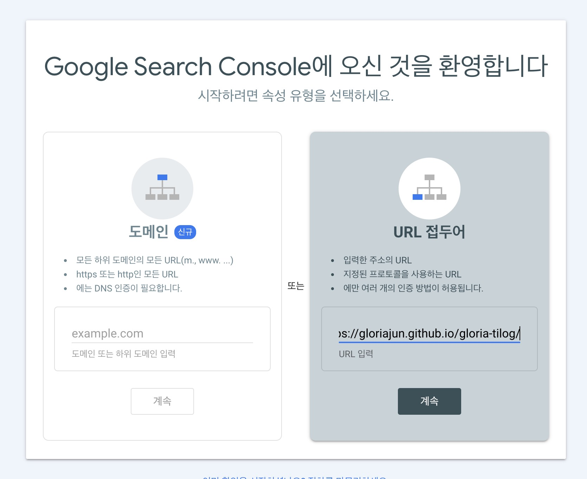
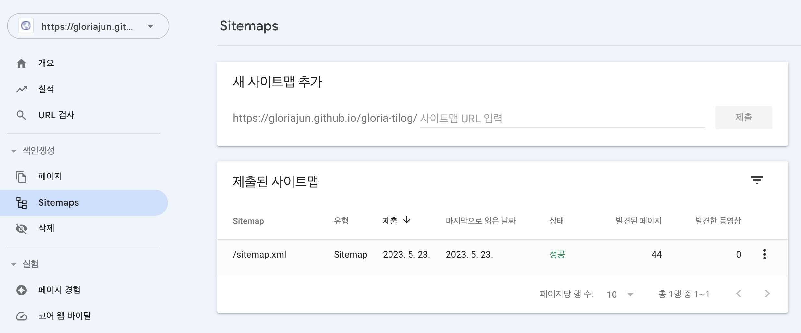

기본적으로 docusaurus 공식문서에서는 검색 기능 구현 관련하여 [Algolia](https://docusaurus.io/ko/docs/next/search)를 가이드하고 있다.
하지만, 나는 Google 검색에서 내 블로그를 노출시키고, [Google Search Console](https://search.google.com/search-console/welcome?hl=ko)을 활용해보고 싶어 이 부분에 대한 설정을 확인해보았다.

## trailingSlash 설정 값 확인

[`trailingSlash`](https://docusaurus.io/ko/docs/next/api/docusaurus-config#trailingSlash) 설정이 **false**로 설정한다.

```bash title="docusaurus.config.js"
  // ...
  favicon: 'img/favicon.ico',
  organizationName: 'gloriajun', // Usually your GitHub org/user name.
  projectName: 'gloria-tilog', // Usually your repo name.
  // highlight-next-line
  trailingSlash: false,
  // ...
```

해당 설정을 `false`로 해주어야 각 작성한 문서에 대하여 생성한 url의 문서에 대한 html 파일이 이름이 `<문서명>.html`로 생성이 되고,
구글 검색 엔진에서는 이와 같이 설정되어야 정상적으로 확인이 된다고 한다.

## Google Search Console 등록

[Google Search Console](https://search.google.com/search-console/welcome?hl=ko)의 다음과 같은 화면에서 blog url을 등록한다.


그 다음에는 다음과 같은 창에서 "html 태그"를 선택하고, meta tag 정보를 복사한다.


해당 정보를 `docusaurus.config.js` 파일에 적용한다.

```bash title="docusaurus.config.js"
  // ...
 themeConfig:
    /** @type {import('@docusaurus/preset-classic').ThemeConfig} */
    ({
      // highlight-start
      metadata: [
        {
          name: 'google-site-verification',
          content: '*******',
        },
      ],
      // highlight-end
  // ...
```

해당 정보를 설정 후, blog를 배포한 뒤에 해당 창을 닫아주면, 구글에서 인증을 시도 후 정상 처리가 되면 다음과 같은 팝업을 확인할 수 있다


### Sitemap 등록

[Google Search Console > Sitemap](https://search.google.com/search-console)에 진입하여, blog의 `sitemap.xml` 파일을 설정해준다.


그 뒤에 약 일주일 정도 후에 구글 검색에 `site:<blog url>`과 같이 검색하면 등록한 site에 대해 구글 검색에 노출되는 것을 확인할 수 있다.
