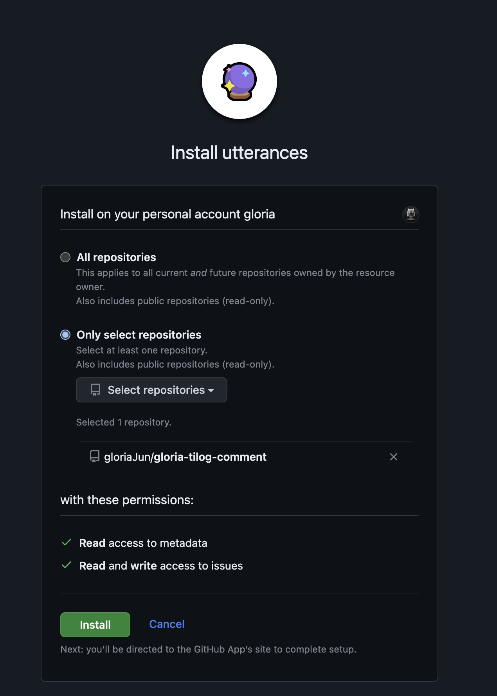

개인 개발 블로그에 `Utterances` 적용을 하기 위한 과정을 간략히 정리해두었다.

<!--truncate-->

코멘트 기능을 추가하기 위해 [Utterances](https://utteranc.es/)를 적용하였다.
Disqus도 있지만, Github의 Repo의 issue로 관리가 된다는 부분이 매력적이고 가벼운 느낌이 들어 해당 플랫폼을 선택하게 되었다.

## utterances 설정

### Comment가 등록될 Repo를 정하기

블로그 소스가 관리되는 repo를 사용하여도 되지만, 나는 블로그에 추가할 기능이나 수정할 부분이 있으면 깃이슈로 등록하여 기록하고 있어서 별도의 레포를 생성하였다.
그리고 Comment를 관리하기 위한 레포는 utterances 앱이 접근할 수 있는 권한이 있어야 하고, public repo 여야 한다.

### utterances App Install

[utterances GitHub App](https://github.com/apps/utterances)을 생성한 Repo에 설치해준다.

comment를 관리하고자 하는 레포에만 설치해주었다.


### Check & Copy Utterance Configuration

utterances App을 설치하고나면 https://utteranc.es/?installation_id=37845297&setup_action=install 링크가 노출이 되는데,
해당 화면을 통하여 Comment가 노출되도록 하기 위한 설정을 확인할 수 있다.

다음 예시와 같이 설치하고자 하는 레포 이름, 이슈 타이틀을 무엇으로 설정하도록 할 것인지 등을 설정한 뒤 제일 하단의 `Enable Utterance` 부분에 작성된 내용을 확인해둔다.


## Add Comment Component

utterances의 script 설정 부분을 참고하여 다음과 같이 Comment Component를 작성하였다.

```javascript title="src/components/Comment/index.tsx"
import React, { useEffect, useRef } from 'react';

import { useColorMode } from '@docusaurus/theme-common';

const utteranceDomain = 'https://utteranc.es';

export function Comment() {
  const { colorMode } = useColorMode();

  const boxRef = useRef < HTMLDivElement > null;

  useEffect(() => {
    if (!boxRef.current) {
      return;
    }

    const utteranceFrameElement =
      boxRef.current.querySelector < HTMLIFrameElement > '.utterances-frame';
    const theme = `github-${colorMode}`;

    if (utteranceFrameElement) {
      utteranceFrameElement.contentWindow.postMessage(
        {
          type: 'set-theme',
          theme,
        },
        utteranceDomain,
      );
    } else {
      const script = document.createElement('script');
      script.src = `${utteranceDomain}/client.js`;
      script.setAttribute('repo', 'gloriaJun/gloria-tilog-comment');
      script.setAttribute('issue-term', 'title');
      script.setAttribute('theme', theme);
      script.crossOrigin = 'anonymous';
      script.async = true;

      boxRef.current.appendChild(script);
    }
  }, [colorMode]);

  return <div ref={boxRef} />;
}
```

### Override BlogPostItem & DocItem

Document와 Blog 형태의 글에 모두 댓글 기능을 추가해주기 위해, **DocItem**과 **BlogPostItem** 컴포넌트를 swizzle 기능을 이용하여 꺼내주었다.

```bash npm2yarn
npm swizzle @docusaurus/theme-classic BlogPostItem --wrap
npm swizzle @docusaurus/theme-classic DocItem --wrap
```

참고로 나는 @nx-plus를 이용하여 nx 환경에 docusaurus를 구성하였는데, 이 경우 swizzle 실행 시 잘 안되어 다음과 같이 실행하였다.

```bash
npx docusaurus swizzle @docusaurus/theme-classic BlogPostItem --wrap
npx docusaurus swizzle @docusaurus/theme-classic DocItem --wrap
```

그 뒤에 **DocItem**과 **BlogPostItem** 컴포넌트를 열어서 앞에서 작성한 Comment 컴포넌트를 하단에 추가해준다.

```javascript title="src/theme/BlogPostItem/index.tsx"
import React from 'react';

import { useBlogPost } from '@docusaurus/theme-common/internal';
import { Comment } from '@site/src/components/Comment';
import BlogPostItem from '@theme-original/BlogPostItem';

export default function BlogPostItemWrapper(props) {
  // highlight-next-line
  const { isBlogPostPage } = useBlogPost();

  return (
    <>
      <BlogPostItem {...props} />
      // highlight-next-line
      {isBlogPostPage && <Comment />}
    </>
  );
}
```

```javascript title="src/theme/DocItem/index.tsx"
import React from 'react';

import { Comment } from '@site/src/components/Comment';
import DocItem from '@theme-original/DocItem';

export default function BlogPostItemWrapper(props) {
  return (
    <>
      <BlogPostItem {...props} />
      // highlight-next-line
      <Comment />
    </>
  );
}
```
