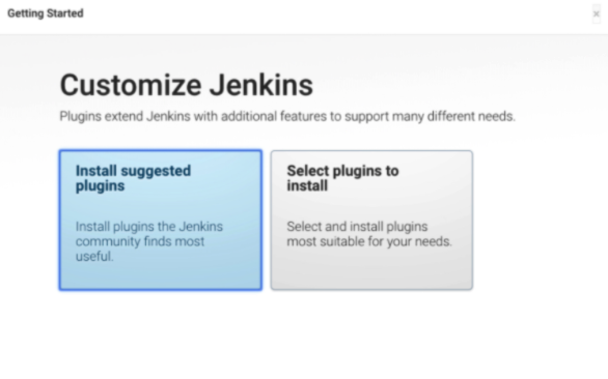
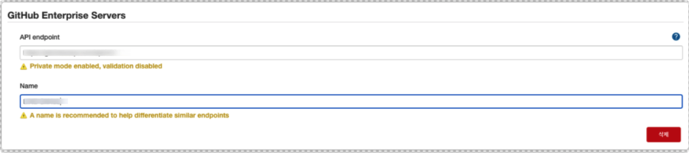

회사에서 개발 환경에 대한 CI 환경 구성을 하며 정리했던 기록이다.

구성한 환경은 아래와 같다.

> Server: CentOS 7.9 4cpu 12ram 100G SSD
> Jenkins v2.277.4
> SonarQube v7.9.4

젠킨스를 서버에 설치 및 설정을 하는 과정이다.

## Installation with Docker

젠킨스는 도커를 이용하여 설치하였다.
도커 구성 시, 젠킨스 서버에 SSL을 적용하기 위해 nginx도 같이 설치하였다.

###### docker-compose-jenkins.xml

```bash
version: '3.7'

services:
  jenkins:
    image: jenkins/jenkins:lts
    container_name: jenkins
    privileged: true
    restart: always
    volumes:
      - /var/run/docker.sock:/var/run/docker.sock
      - /usr/bin/docker:/usr/bin/docker
      - "$HOME/jenkins_home:/var/jenkins_home"
    ports:
      - 8080:8080
      - 5000:5000
      - 50000:50000
    environment:
      TZ: 'Asia/Seoul'

  nginx:
    image: nginx:latest
    container_name: nginx
    privileged: true
    restart: always
    volumes:
      - ./nginx/jenkins.conf:/etc/nginx/conf.d/default.conf
			# 아래는 ssl 인증서가 위치한 경로
      - ./certs:/etc/nginx/certs
    ports:
      - 80:80
			# ssl 적용을 안하는 경우 아래의 port는 주석 처리
      - 443:443
    environment:
      TZ: 'Asia/Seoul'
```

###### nginx/jenkins.conf

```bash
server {
  listen 80;
  # 도메인이 없으면...
  # server_name _;
  server_name ci-jenkins.dev.me;

  return 301 https://$server_name$request_uri;
}

server {
		# ssl 적용을 안하는 경우
    #listen 8080;
    listen 443 ssl;

    # 도메인이 없으면...
    # server_name _;
    server_name ci-jenkins.dev.me;
    access_log off;

		# ssl 적용을 안하는 경우 아래의 ssl 설정은 주석 처리
    ssl_certificate		/etc/nginx/certs/*.line-dev.me_fullchain.crt;
    ssl_certificate_key		/etc/nginx/certs/*.line-dev.me.key;

    location / {
      proxy_pass     http://jenkins:8080;

      proxy_set_header   Host             $host;
      proxy_set_header   X-Real-IP        $remote_addr;
      proxy_set_header   X-Forwarded-For  $proxy_add_x_forwarded_for;
      proxy_set_header   X-Forwarded-Proto http;
      proxy_max_temp_file_size 0;


      proxy_connect_timeout      150;
      proxy_send_timeout         100;
      proxy_read_timeout         100;

      proxy_buffer_size          8k;
      proxy_buffers              4 32k;
      proxy_busy_buffers_size    64k;
      proxy_temp_file_write_size 64k;
   }
}
```

젠킨스 내부에서 생성되는 jenkins 유저의 id는 기본적으로 1000인데, 해당 유저를 생성하지 않으면 권한 부여 시 아이디로 주면된다.
근데 이왕이면 아이디보다 사용자명으로 보이는 게 좋은 것 같아서 동일한 아이디로 로컬 서버에 jenkins 유저를 생성하고, docker 그룹에 포함시켰다.
(docker 그룹은 docker 설치 시에 생성되는 group 이다.)

```bash
sudo /usr/sbin/useradd jenkins -u 1000
sudo /usr/sbin/usermod -aG docker jenkins
```

도커 컨테이너 실행 전에 젠킨스 파일이 위치할 폴더 생성를 생성해주고, jenkins 유저에게 소유권을 넘겨준다.

```bash
mkdir -p /home1/irteam/jenkins_home
sudo chown -R jenkins:docker /home1/irteam/jenkins_home
```

이제 위에서 생성한 docker compose 파일을 이용하여 도커 컨테이너를 띄운다.

```bash
docker-compose -f docker-compose-jenkins.yml up -d
```

컨테이너 실행 후에 아래와 같은 명령어를 이용하여 정상적으로 기동 및 실행 중인지 확인할 수 있다.

```bash
$ docker ps
CONTAINER ID   IMAGE                 COMMAND                  CREATED      STATUS        PORTS                                                                                                                                 NAMES
87b845067443   nginx:latest          "/docker-entrypoint.…"   2 days ago   Up 47 hours   0.0.0.0:80->80/tcp, :::80->80/tcp, 0.0.0.0:443->443/tcp, :::443->443/tcp                                                              nginx
4ad4deda6d02   jenkins/jenkins:lts   "/sbin/tini -- /usr/…"   2 days ago   Up 47 hours   0.0.0.0:5000->5000/tcp, :::5000->5000/tcp, 0.0.0.0:8080->8080/tcp, :::8080->8080/tcp, 0.0.0.0:50000->50000/tcp, :::50000->50000/tcp   jenkins
```

만약, 도커 컨테이너 실행 시 후에 에러가 발생하였다거나, 실행 로그를 확인하고 싶으면 다음과 같이 확인할 수 있다.

```bash
docker container logs <container_name>

# ex) docker container logs jenkins
```

정상적으로 젠킨스가 실행이 되었다면...아래와 같은 방법으로 접속하여 확인해볼 수 있다.

- 설정 하지 않은 경우(로컬 서버에 설치한 경우) : 예) http://localhost
- 도메인을 생성 및 ssl이 적용된 경우 : 예) https://ci-jenkins.dev.me

## Getting Started Jenkins

젠킨스에 설치 후 웹 브라우저를 이용하여 최초로 접속하는 경우에는 설치 시 설정된 초기 패스워드를 확인하여 접속해야한다.
초기 패스워드는 다음과 같은 방법으로 확인할 수 있다.

```bash
docker exec jenkins cat /var/jenkins_home/secrets/initialAdminPassword
```

해당 패스워드를 이용하여 로그인을 하고 나면 아래와 같이 플러그인을 설치하라는 매뉴가 나온다.
대부분 기본적으로 젠킨스에서 제안하는 플러그인을 설치하지만, 원하면 각각 별도로 플러그인을 골라서 설치할 수도 있다.


플러그인 설치가 완료가 되면, 초기 로그인 사용자에 대한 설정을 하는 화면이 나오게 된다.

그러면 일단 젠킨스 설치는 완료!!!

## Configuration Jenkins

사용자가 설정한 사용자로 로그인을 하고 나면 이제 젠킨스 CI 구성에 필요한 플러그인을 설치한다.
플러그인은 **젠킨스 관리 → 플러그인 관리** 매뉴로 접근하여 **설치가능** 탭을 클릭하여 원하는 플러그인을 선택하여 설치하면 된다.


나는 CI 환경 구성을 위해 아래와 같은 플러그인들을 설치하였다.

- Warnings Next Generation
  
  - ESLint와 같은 정적 분석 도구에 대한 리포트를 생성하기 위해 설치
  - https://plugins.jenkins.io/warnings-ng/
- GitHub Authentication
  - 사내 GitHub 계정을 이용하여 로그인을 할 수 있도록 설정하기 위해 설치 (즉, GitHub AOuth 이용을 위함)
  - https://plugins.jenkins.io/github-oauth/https://plugins.jenkins.io/github-oauth/
- GitHub Integration
  - https://plugins.jenkins.io/github-pullrequest/
- Blue Ocean
  - jenkinsfiles 를 이용하여 스크립트를 정의할 수 있고, 좀 더 이쁜 파이프라인 그래프를 확인할 수 있다.
  - https://plugins.jenkins.io/blueocean/
- docker pipeline
  - https://plugins.jenkins.io/docker-workflow/
- SSH Pipeline Steps
  - pipeline 내에서 ssh 명령어를 사용하기 위함
  - https://plugins.jenkins.io/ssh-steps/
- Embeddable Build Status
  - 빌드 상태에 대해 README에 뱃지를 등록하기 위함
  - https://plugins.jenkins.io/embeddable-build-status/
- Slack Notification Plugin
  - slack으로 알림 전송을 위함
  - https://plugins.jenkins.io/slack/
- Merics
  - 각 빌드 stage 간의 시간 등을 기록하기 위함
  - https://plugins.jenkins.io/metrics/

### System Configuration

**Jenkins 관리 -> 시스템 설정**에서 다음과 같은 설정을 하였다.

#### Github OAuth 설정

GitHub 계정을 이용하여 로그인을 하기 위해 **Configure Global Security**에서 설정을 해주어야 한다.


젠킨스 서버에 대한 정보를 GitHub에 로그인 후, **Settings - Developer Settings - OAuth Apps**에서 OAuth App을 생성하여 등록해준다.


- Homepage URL : jenkins domain
- Authorization callback URL : [jenkins domain]/securityRealm/finishLogin

#### Github Server 설정

**GitHub Sever** 설정을 한다.


GitHub에 로그인을 위해 사용하는 Token 정보는 해당 매뉴의 **고급** 버튼을 클릭해서 출력되는 매뉴에서 다음과 같은 매뉴를 통해 생성할 수 있다.


위와 같이 GitHub Token을 생성하면, GitHub에 로그인 후 **Settings - Developer Settings - Personal Access Token** 매뉴에서 생성된 토큰을 확인할 수 있다.

#### Github API 설정

엔터프라이즈 GitHub을 사용하는 경우, 해당 매뉴를 통해 등록을 해주어야한다.


일단 이렇게 기본적인 설정을 완료하였다.
빌드 Job 생성에 대한 과정은 다음에....
