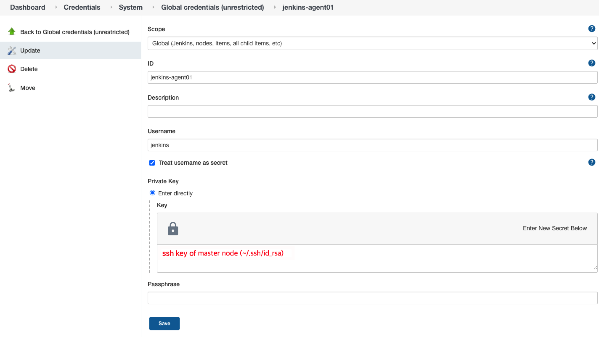

회사에서 개발 환경에 대한 CI 환경 구성을 하며 정리했던 기록이다.

구성한 환경은 아래와 같다.

> Server: CentOS 7.9 8cpu 32ram 100G SSD
> Docker v20.10.7
> Docker Compose v1.28.6
> Jenkins v2.277.4
> SonarQube v7.9.4

젠킨스를 서버에 설치 및 설정을 하는 과정이다.
젠킨스의 설치 환경 구성은 도커 환경 위에 Jenkins와 SSL 적용을 위해 nginx를 설치하여 proxy 구성을 하였다.

## Create the nginx config files

### ./conf/nginx.conf

```bash
user nginx;
worker_processes 1;

error_log /var/log/nginx/error.log warn;
pid /var/run/nginx.pid;

events {
    worker_connections 1024;
}

http {
    include /etc/nginx/mime.types;
    default_type application/octet-stream;

    # 웹 설정하는 부분
    include /etc/nginx/conf.d/*.conf;

    # 로그 파일에 대한 포맷을 설정해주는 부분
    log_format main '$remote_addr - $remote_user [$time_local] "$request" '
      '$status $body_bytes_sent "$http_referer" '
      '"$http_user_agent" "$http_x_forwarded_for"';
    access_log /var/log/nginx/access.log main;

    # https://www.lesstif.com/system-admin/nginx-http-413-client-intended-to-send-too-large-body-86311189.html
    client_max_body_size 8M;

    # gzip configuration
    gzip on;
    gzip_disable "msie6";
    gzip_min_length 10240;
    gzip_buffers 32 32k;
    gzip_comp_level 9;
    gzip_proxied any;
    gzip_types text/plain application/javascript application/x-javascript text/javascript text/xml text/css;
    gzip_vary on;

    sendfile on;
    keepalive_timeout 65;
}

```

### ./conf/jenkins.conf

```bash
upstream jenkins {
    server jenkins-master:8080;
}

server {
    listen 80 default_server;
    listen [::]:80 default_server;
    server_name "_";

    location / {
	proxy_set_header    X-Real-IP           $remote_addr;
	proxy_set_header    X-Forwarded-For     $proxy_add_x_forwarded_for;
	proxy_set_header    X-Forwarded-Proto   $scheme;
	proxy_set_header    Host                $host;
	proxy_set_header    X-Forwarded-Host    $host;
	proxy_set_header    X-Forwarded-Port    $server_port;
	proxy_set_header    X-NginX-Proxy       true;
	proxy_pass_header   Set-Cookie;
	proxy_http_version  1.1;
	proxy_cache_bypass  $http_upgrade;
	proxy_pass http://jenkins/;
   }
}
```

## Create docker compose files

먼저 jenkins master node를 위한 컨테이너와 nginx 컨테이너를 정의한다.

```bash
version: "3"
services:
  nginx:
    image: nginx:latest
    container_name: nginx
    hostname: nginx
    privileged: true
    restart: always
    volumes:
      - ./conf/jenkins.conf:/etc/nginx/conf.d/jenkins.conf
      - ./conf/nginx.conf:/etc/nginx/nginx.conf
    ports:
      - 80:80
    environment:
      - TZ=Asia/Seoul
    depends_on:
      - jenkins-master

  jenkins-master:
    image: jenkins/jenkins:lts
    container_name: jenkins-master
    hostname: jenkins-master
    privileged: true
    restart: always
    volumes:
      - /var/run/docker.sock:/var/run/docker.sock
      - /usr/bin/docker:/usr/bin/docker
      - $HOME/jenkins_master:/var/jenkins_home
    environment:
      - TZ=Asia/Seoul
```

### jenkins 유저 생성 및 jenkin home 폴더 생성

**jenkins_home** 폴더를 생성하여 젠킨스 사용자에게 소유권을 넘기기 위한 과정이다.

젠킨스 내부에서 생성되는 jenkins 유저의 id는 기본적으로 1000인데, 해당 유저를 생성하지 않으면 권한 부여 시 아이디로 주면되므로 사용자 생성 부분은 생략해도 된다.
하지만, 나는 이왕이면 아이디보다 사용자명으로 보이는 게 좋은 것 같아서 동일한 아이디로 로컬 서버에 jenkins 유저를 생성하고, docker 그룹에 포함시켰다.
(docker 그룹은 docker 설치 시에 생성되는 group 이다.)

```bash
sudo /usr/sbin/useradd jenkins -u 1000
sudo /usr/sbin/usermod -aG docker jenkins
```

도커 컨테이너 실행 전에 젠킨스 파일이 위치할 폴더 생성를 생성해주고, jenkins 유저에게 소유권을 넘겨준다.

```bash
mkdir -p /home1/irteam/jenkins_home
sudo chown -R jenkins:docker /home1/irteam/jenkins_home
```

### docker container 기동

이제 위에서 생성한 docker compose 파일을 이용하여 도커 컨테이너를 띄운다.

```bash
docker-compose up -d
```

컨테이너 실행 후에 아래와 같은 명령어를 이용하여 정상적으로 기동 및 실행 중인지 확인할 수 있다.

```bash
$ docker ps
CONTAINER ID   IMAGE                      COMMAND                  CREATED          STATUS                  PORTS                                NAMES
7b527bf37770   nginx:latest               "/docker-entrypoint.…"   41 minutes ago   Up 24 minutes           0.0.0.0:80->80/tcp                   nginx
66c7edd6be59   jenkins/jenkins:lts        "/sbin/tini -- /usr/…"   41 minutes ago   Up 24 minutes           8080/tcp, 0.0.0.0:50000->50000/tcp   jenkins-master
```

만약, 도커 컨테이너 실행 시 후에 에러가 발생하였다거나, 실행 로그를 확인하고 싶으면 다음과 같이 확인할 수 있다.

```bash
docker container logs <container_name>

# ex) docker container logs jenkins
```

정상적으로 젠킨스가 실행이 되었다면...nginx에서 젠킨스의 8080 포트를 nginx를 통하여 80 포트로 포트포워딩 처리를 하였으므로 웹브라우저를 통하여 **http://<server_ip>** 주소로 젠킨스 관리자 화면에 접근할 수 있다.

## Getting Started Jenkins

젠킨스에 설치 후 웹 브라우저를 이용하여 최초로 접속하는 경우에는 설치 시 설정된 초기 패스워드를 확인하여 접속해야한다.
초기 패스워드는 다음과 같은 방법으로 확인할 수 있다.

```bash
docker exec jenkins cat /var/jenkins_home/secrets/initialAdminPassword
```

해당 패스워드를 이용하여 로그인을 하고 나면 아래와 같이 플러그인을 설치하라는 매뉴가 나온다.
대부분 기본적으로 젠킨스에서 제안하는 플러그인을 설치하지만, 원하면 각각 별도로 플러그인을 골라서 설치할 수도 있다.


플러그인 설치가 완료가 되면, 초기 로그인 사용자에 대한 설정을 하는 화면이 나오게 된다.

그러면 일단 젠킨스 설치는 완료!!!

## Add jenkins slave node

이제 기본적인 젠킨스 설치는 마쳤으므로 slave node 추가를 위한 설정을 한다.
아래와 같이 master container에 접근하여 ssh key를 생성한다.

```bash
$ docker container exec -it jenkins-master /bin/bash
jenkins@jenkins-master:/$  ssh-keygen -t rsa -C "jenkins-master"
Generating public/private rsa key pair.
Enter file in which to save the key (/var/jenkins_home/.ssh/id_rsa):
Created directory '/var/jenkins_home/.ssh'.
Enter passphrase (empty for no passphrase):
Enter same passphrase again:
Your identification has been saved in /var/jenkins_home/.ssh/id_rsa.
Your public key has been saved in /var/jenkins_home/.ssh/id_rsa.pub.
The key fingerprint is:
SHA256:wmChG3ToFUv4hCSzvhAai2Rx/aRVHv63cDeaqjxehnM jenkins-master
The key's randomart image is:
+---[RSA 2048]----+
|ooo=*.  .o       |
| =*+o+ oo .      |
|++o++ =  o       |
|*+.+.+ .  .      |
|=..   o S  o o o |
|. .    .  . + = .|
| .       o E +   |
|        ..= .    |
|        .+o.     |
+----[SHA256]-----+
```

그리고 **~/.ssh** 폴더로 이동하여 `id_rsa.pub` 키를 클립보드로 복사해둔다.

```bash
jenkins@jenkins-master:/$ cat ~/.ssh/id_rsa.pub
ssh-rsa AAAAB3NzaC1yc.....
```

### docker compose에 slave 노드 정의 추가

앞에서 정의한 docker-compose.yml 파일에 slave node에 대한 정의를 추가해준다.

```bash
  jenkins-master:
    image: jenkins/jenkins:lts
    container_name: jenkins-master
    hostname: jenkins-master
    privileged: true
    restart: always
    volumes:
      - /var/run/docker.sock:/var/run/docker.sock
      - /usr/bin/docker:/usr/bin/docker
      - $HOME/jenkins_master:/var/jenkins_home
    environment:
      - TZ=Asia/Seoul
    links:
      - jenkins-agent01

  jenkins-agent01:
    image: jenkins/ssh-agent:latest
    container_name: jenkins-agent01
    hostname: jenkins-agent01
    privileged: true
    restart: always
    volumes:
      - /var/run/docker.sock:/var/run/docker.sock
      - /usr/bin/docker:/usr/bin/docker
      - $HOME/jenkins_agent:/var/jenkins_home
    environment:
      - JENKINS_AGENT_SSH_PUBKEY=ssh-rsa AAAAB3NzaC1yc2EAAAADAQABAAABAQDLT3ZHpTr...
      - TZ=Asia/Seoul
```

컨테이너를 재기동한다.

```bash
docker container stop jenkins-master
docker container stop nginx
docker-compose up -d
```

### 노드 추가

젠킨스 웹페이지에 접속하여 노드 추가 하기 전에 **Jenkins관리 > Manage Credentials** 에서 ssh key를 등록한다.



credential 키를 등록한 뒤에 **Jenkins관리 > 노드관리 > 신규 노드** 매뉴로 접근하여 agent를 등록한다.


## Trouble Shooting

### java.io.IOException: Java not found on hudson.slaves.SlaveComputer@63a0ae53. Install Java 8 or Java 11 on the Agent.

agent 노드 추가 후에 launch 시에 아래와 같은 에러 로그가 노출이 되면 **Jenkins관리 > 노드관리**에서 해당 agent 노드의 java path를 설정해준다.

```bash
java.io.IOException: Java not found on hudson.slaves.SlaveComputer@63a0ae53. Install Java 8 or Java 11 on the Agent.
	at hudson.plugins.sshslaves.JavaVersionChecker.resolveJava(JavaVersionChecker.java:84)
	at hudson.plugins.sshslaves.SSHLauncher$1.call(SSHLauncher.java:453)
	at hudson.plugins.sshslaves.SSHLauncher$1.call(SSHLauncher.java:421)
	at java.util.concurrent.FutureTask.run(FutureTask.java:266)
	at java.util.concurrent.ThreadPoolExecutor.runWorker(ThreadPoolExecutor.java:1149)
	at java.util.concurrent.ThreadPoolExecutor$Worker.run(ThreadPoolExecutor.java:624)
	at java.lang.Thread.run(Thread.java:748)
[07/05/21 17:26:56] Launch failed - cleaning up connection
```

아래와 같이 해당 agent 노드에 접속하여 java path를 확인하고 설정

```bash
$ docker container exec -it jenkins-agent01 /bin/bash
root@jenkins-agent01:/home/jenkins# which java
/usr/local/openjdk-8/bin/java
```

### java.io.IOException: Could not copy remoting.jar into '/var/jenkins_home ' on agent

```bash
[07/05/21 17:35:37] [SSH] Remote file system root /var/jenkins_home  does not exist. Will try to create it...
java.io.IOException: Could not copy remoting.jar into '/var/jenkins_home ' on agent
	at hudson.plugins.sshslaves.SSHLauncher.copyAgentJar(SSHLauncher.java:738)
	at hudson.plugins.sshslaves.SSHLauncher.access$400(SSHLauncher.java:111)
	at hudson.plugins.sshslaves.SSHLauncher$1.call(SSHLauncher.java:456)
	at hudson.plugins.sshslaves.SSHLauncher$1.call(SSHLauncher.java:421)
	at java.util.concurrent.FutureTask.run(FutureTask.java:266)
	at java.util.concurrent.ThreadPoolExecutor.runWorker(ThreadPoolExecutor.java:1149)
	at java.util.concurrent.ThreadPoolExecutor$Worker.run(ThreadPoolExecutor.java:624)
	at java.lang.Thread.run(Thread.java:748)
Caused by: java.io.IOException: Failed to mkdir /var/jenkins_home
	at com.trilead.ssh2.jenkins.SFTPClient.mkdirs(SFTPClient.java:91)
	at hudson.plugins.sshslaves.SSHLauncher.copyAgentJar(SSHLauncher.java:695)
	... 7 more
Caused by: com.trilead.ssh2.SFTPException: Permission denied (SSH_FX_PERMISSION_DENIED: The user does not have sufficient permissions to perform the operation.)
	at com.trilead.ssh2.SFTPv3Client.expectStatusOKMessage(SFTPv3Client.java:555)
	at com.trilead.ssh2.SFTPv3Client.mkdir(SFTPv3Client.java:955)
	at com.trilead.ssh2.jenkins.SFTPClient.mkdirs(SFTPClient.java:89)
	... 8 more
```

## References

- [(Nginx) 기본 설정 방법](https://architectophile.tistory.com/12)
- [실제로 사용 가능한 nginx 프록시 서버 만들기 (docker-compose)](https://elvanov.com/2312)
- [젠킨스 Master/Slave 분산 빌드 환경 도커로 구축하기](https://cornswrold.tistory.com/510)
